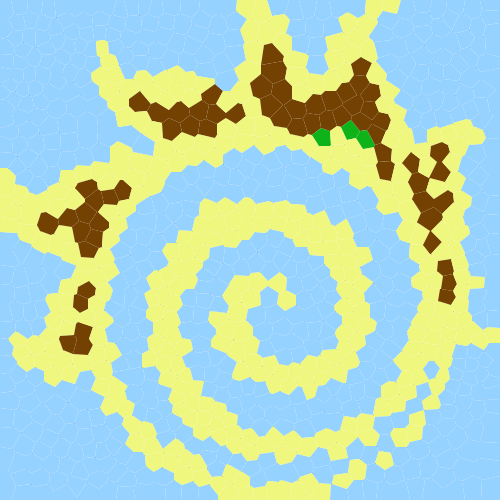
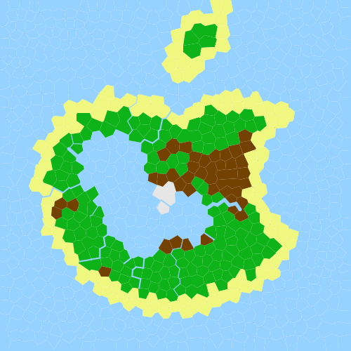
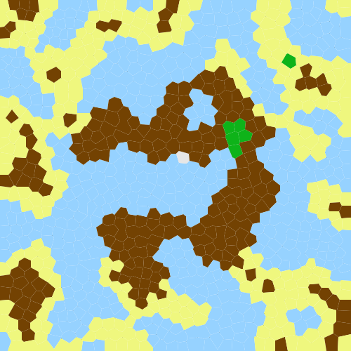
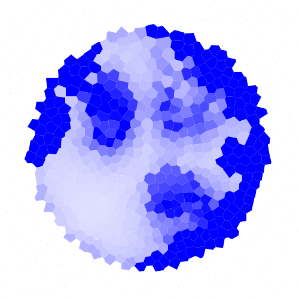

# Project: Island Generator

- Zifan Si [siz@mcmaster.ca]
- Pega Liu [liu927@mcmaster.ca]
- Tianjiao Xiao [xiaot13@mcmaster.ca]

## How to run the product

### Installation instructions

This product is handled by Maven, as a multi-module project. We assume here that you have cloned the project in a
directory named `A2`

To install the different tooling on your computer, simply run:

```
mosser@azrael A2 % mvn install
```

After installation, you'll find an application named `generator.jar` in the `generator` directory, and a file
named `visualizer.jar` in the `visualizer` one.

### Generator

To run the generator, go to the `generator` directory, and use `java -jar` to run the product. The product takes several
arguments:

- the name of the file to store the mesh
- the type of the mesh (-g for grid, -t for triangles, -i for voronoi)
- the width of the mesh (in px)
- the height of the mesh (in px)
- the number of sites (for the Voronoi mesh) or the size of the squares (for other meshes)
- the thickness of the segments (in px)
- the thickness of the vertices (in px)
- the number of relaxation steps (for the Voronoi mesh only)

```
mosser@azrael A2 % cd generator 
# run in production mode
mosser@azrael generator % java -jar generator.jar sample.mesh [options] [width] [height] [squareSize/sitesCount] [segmentThickness] [vertexThickness] [relaxation]
# run in debug mode 
mosser@azrael generator % mvn -q exec:java -Denv=debug -Dexec.args="sample.mesh [options] [width] [height] [squareSize/sitesCount] [segmentThickness] [vertexThickness] [relaxation]"
mosser@azrael generator % ls -lh sample.mesh
-rw-r--r--  1 mosser  staff    29K 29 Jan 10:52 sample.mesh
mosser@azrael generator % 
```

#### Generator Examples

```
# Create grid meshes with 500px width, 500px height, squareSize of 50px, segmentThickness of 1px and vertexThickness of 1px:
mosser@azrael generator % java -jar generator.jar sample.mesh -g 500 500 50 1 1
# Create triangle meshes with 500px width, 500px height, squareSize of 50px, segmentThickness of 1px and vertexThickness of 1px:
mosser@azrael generator % java -jar generator.jar sample.mesh -t 500 500 50 1 1
# Create Voronoi meshes with 500px width, 500px height, 100 sites, segmentThickness of 1px, vertexThickness of 1px and 10 relaxation steps:
mosser@azrael generator % java -jar generator.jar sample.mesh -i 500 500 100 1 1 10
```

### Island

To generate an island based on generated mesh, go the `island` directory, and use `java -jar` to run the product. The product take the following arguments:

- **input** (positional): input mesh file path
- **output** (positional): output mesh file path
- **shape**: (default to `apple`)
  - `apple`: apple shape
  - `circle`: circle shape
  - `perlin`: shape based on perlin noise
  - `<image file path>`: shape based on the image, the black pixels will be the sea
- **elevation**: (default to `seaDistance`)
  - `flatland`: flatland terrain with maximum elevation of 1000
  - `mountain`: mountain terrain with maximum elevation of 6000
  - `seaDistance`: the terrain goes higher as the distance to the sea increases
- **elevationNoise**: amount of random noise added to the elevation (default to 100)
- **maxLakes**: maximum amount of lakes (default to 4)
- **maxRivers**: maximum amount of rivers (default to 20)
- **maxAquifers**: maximum amount of aquifers (default to 4)
- **soilAbsorptionFactor**: adjust how much water is absorbed by the soil (default to 1.0)
- **seed**: number used to generate the random terrain (random if not specified)
- **heatmap**: specify if you want to generate a heatmap (smaller values are represented using white, large values are blue) (default to none)
  - `humidity`: heatmap based on humidity
  - `elevation`: heatmap based on elevation

For examples, see **Gallery** section.

### Visualizer

To visualize an existing mesh, go the `visualizer` directory, and use `java -jar` to run the product. The product take
two arguments:

- the file containing the mesh
- the name of the file to store the visualization (as an SVG image).

```
mosser@azrael A2 % cd visualizer 
# run in production mode
mosser@azrael visualizer % java -jar visualizer.jar ../generator/sample.mesh sample.svg
# run in debug mode
mosser@azrael visualizer % mvn -q exec:java -Denv=debug -Dexec.args="../generator/sample.mesh sample.svg"
mosser@azrael visualizer % ls -lh sample.svg
-rw-r--r--  1 mosser  staff    56K 29 Jan 10:53 sample.svg
mosser@azrael visualizer %
```

In the debug mode, the visualizer will show the centroids in red and segments in black.

To visualize the SVG file:

- Open it with a web browser
- Convert it into something else with tools like `rsvg-convert`

## Gallery

```bash
java -jar island.jar ../generator/sample.mesh out.mesh --shape "fireball.png"
```



```bash
java -jar island.jar ../generator/sample.mesh out.mesh --shape "apple"
```



```bash
java -jar island.jar ../generator/sample.mesh out.mesh --shape "perlin" --elevation "mountain"
```



```bash
java -jar island.jar ../generator/sample.mesh out.mesh --shape "circle" --elevation "mountain" --heatmap "humidity"
```



## How to contribute to the project

When you develop features and enrich the product, remember that you have first to `package` (as in `mvn package`) it so
that the `jar` file is re-generated by maven.

## Backlog
### Definition of Done

definition of done for your features:

- The feature is implemented
- The feature is tested
- The feature is documented

### Product Backlog

**See Report**

